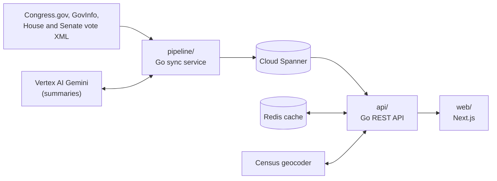

# Just a Bill

Just a Bill lets US citizens read the bills in Congress in plain language, vote on them, and see
how their votes compare with the votes of the people who represent them. It's nonpartisan, free,
and built for regular people rather than policy professionals.

- **Read** a bill: an AI summary in plain language, the official text and how it changed between
  versions, its actions, sponsors and related bills.
- **Vote** Yea or Nay yourself. Without an account, your votes stay in your browser.
- **Compare** your votes with your House member's and senators' roll-call votes, found from your
  address.

All the data is public: bills, actions and texts from [Congress.gov](https://api.congress.gov/) and
[GovInfo](https://www.govinfo.gov/), roll-call votes from the
[House Clerk](https://clerk.house.gov/Votes) and the [Senate](https://www.senate.gov/legislative/votes_new.htm),
and congressional districts from the [US Census Bureau geocoder](https://geocoding.geo.census.gov/).

## Architecture



The repository has five modules:

| Module | What it is |
|---|---|
| [`pipeline/`](pipeline) | Go service that syncs bills, members, texts and roll-call votes on a schedule and writes AI summaries |
| [`db/`](db) | Shared Go module: model types, repository interfaces, the Spanner implementation, migrations (`db/migrations/`) and test helpers |
| [`api/`](api) | Go REST API (Chi) over the database, with a Redis cache, rate limiting and district lookup |
| [`obs/`](obs) | Shared Go module for logs, traces and metrics (OpenTelemetry) |
| [`web/`](web) | Next.js 16, React 19 and Tailwind CSS 4 frontend |

Production runs the web app on Vercel and the backend on Google Cloud. How the scorecard compares
your votes with your representatives' is in
[`docs/methodology/scorecard.md`](docs/methodology/scorecard.md).

## Run it locally

You need Go 1.27, Node 24, Docker and [Task](https://taskfile.dev/docs/installation). Everything
runs against local emulators, so no cloud account is needed.

```bash
cp .env.example .env   # add a free api.data.gov key (https://api.data.gov/signup/) as
                       # CONGRESS_API_KEY and GOVINFO_API_KEY
task setup             # git hooks
task infra:up          # Spanner emulator, Firebase Auth emulator and Redis
task migrate           # create the local database and apply the migrations
task seed              # the current congress
task backfill:quick    # a sample of 100 bills with members, votes and texts, no AI summaries
task dev               # API on http://localhost:8080, web on http://localhost:3000
```

`task test` runs every module's tests and `task --list` shows the rest. AI summaries need a Google
Cloud project with Vertex AI (`GCP_PROJECT` in `.env`); without one the app works without them.

**Only Docker and Task, on macOS or Linux?** The `docker:*` targets run the same checks in a dev
container with the pinned Go, Node and golangci-lint. On a Mac, Docker comes from Docker Desktop,
OrbStack or Colima, and Task from `brew install go-task`.

```bash
task docker:build         # build the dev image once (a few minutes), and after dev/Dockerfile changes
task docker:test          # every module's tests, against the emulators and Redis
task docker:lint          # golangci-lint, ESLint and the dependency license check
task docker:cover         # tests with coverage, checked against the floors
task docker:shell         # a shell in the container; cd api && task docker:run -- go test ./... runs one command
task up                   # the whole app in containers: API on :8080, web on :3000
task docker:run -- task seed   # then load data from the container (task backfill:quick the same way)
```

## How this repository is published

Just a Bill is developed in a private working repository. This repository is published from it
with each release: its `main` branch gets one commit per release, tagged `vX.Y.Z`, holding that
release's code. Development history between releases isn't published.

## Contributing

Contributions are welcome. Read [CONTRIBUTING.md](CONTRIBUTING.md) first: commits need a DCO
sign-off (`git commit -s`), and titles follow Conventional Commits. Everyone taking part follows
the [Code of Conduct](CODE_OF_CONDUCT.md). Report security problems privately as described in
[SECURITY.md](SECURITY.md).

A contribution goes like this:

1. You open a pull request here. CI builds, tests and lints it and checks the title and sign-offs.
2. The maintainer reviews it and, if it's accepted, imports it into the working repository as
   one commit with you as its author and your `Signed-off-by` lines.
3. It ships in the next release. Your pull request is then marked merged, or closed with a link to
   the release, and you're credited as a co-author of the release commit.

## License

Just a Bill is licensed under the [Apache License 2.0](LICENSE). Copyright The Just a Bill Authors;
see [NOTICE](NOTICE).
